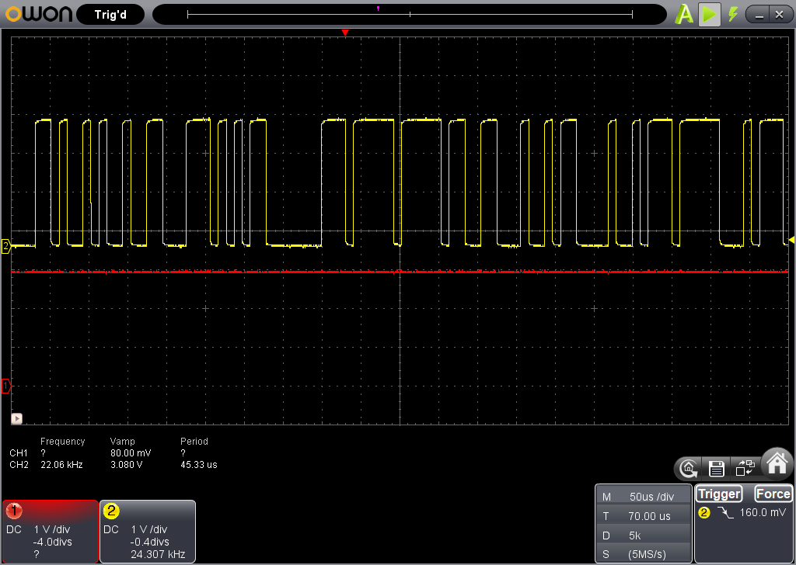
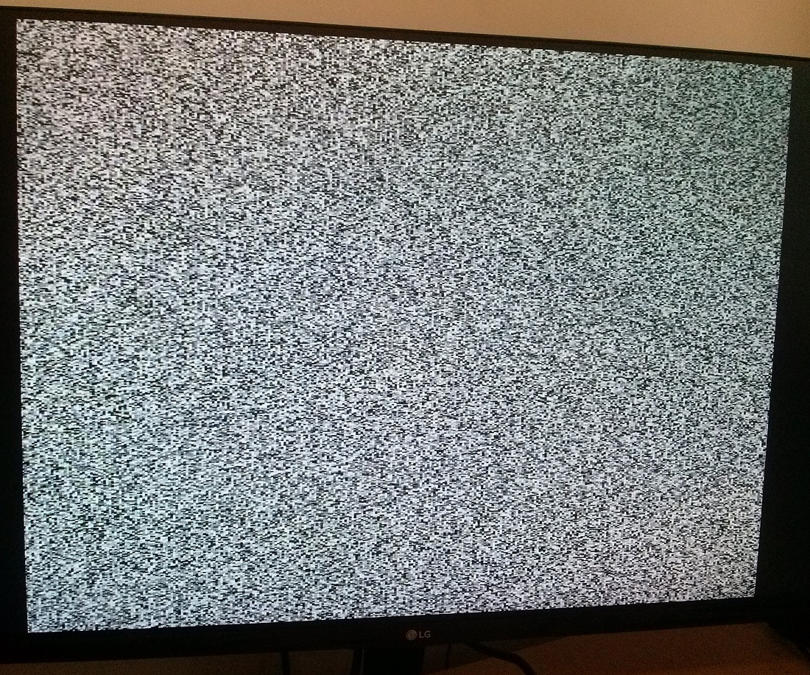

# Episode #1699 LFSR Random Number Generator (White Noise)

LFSR - Linear Feedback Shift Register

LFSR Random Number Generator (White Noise) https://www.youtube.com/watch?v=WGhRAbQ1fRw

 

# BitDemo

Uses 24-bit LFSR like 3 595 shift registers in series, outputs 1 bit value.

 
 

# LedsDemo

Outputs LFSR lower bits into 10 DE0 onboard LEDs.

<video width="640" height="360" controls>
  <source src="doc/CAM00626-ed.mp4" type="video/mp4">
  Your browser does not support the video tag.
</video>
  

# VgaDemo

Useful for any video output implementation for first time live testing, to be sure RGB outputs are not stuck or wired to wrong signals. 
For better non-repeative randomness uses 32 bits LFSR.

