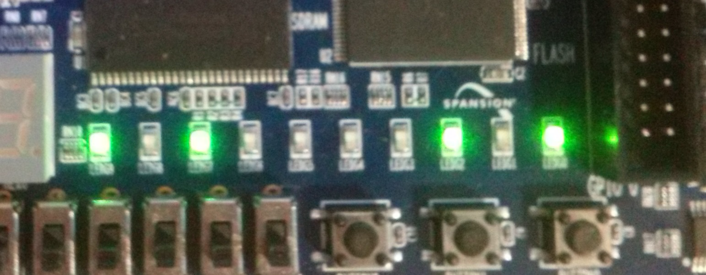

# Episode #1699

LFSR - Linear Feedback Shift Register

LFSR Random Number Generator (White Noise) https://www.youtube.com/watch?v=WGhRAbQ1fRw

 

# BitDemo

Uses 24-bit LFSR like triple 595 shift registers in series, outputs 1 bit value.

 
 

# LedsDemo

Outputs LFSR lower bits into 10 LEDs on DE0 onboard.

 

Video demo:
https://github.com/user-attachments/assets/c27f9ea6-12c2-4042-8be1-6437bfb8a787
  

# VgaDemo

Useful for any video output implementation for first time live testing, to be sure RGB outputs are not stuck or wired to wrong signals. 
For better non-repeative randomness uses 32 bits LFSR. Acts like static noise on old analog TV without signal.

