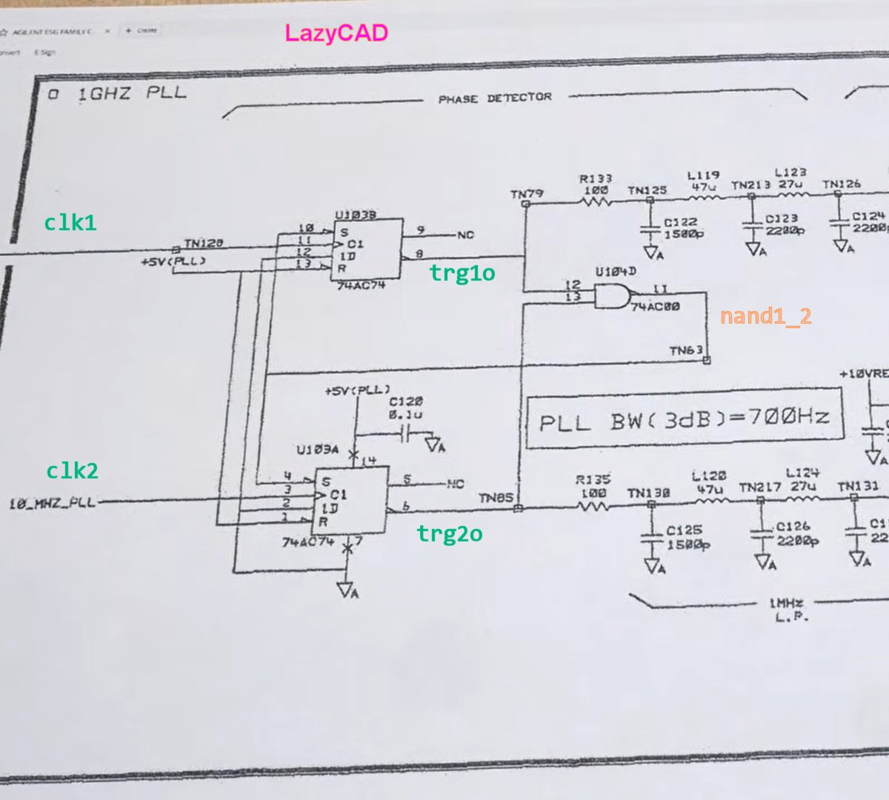

# Episode #2680

PLL Phase Detector using 7474 
https://www.youtube.com/watch?v=r38NwxkmWgA

Best for testing and observation with oscilloscope, not in simulation testbench, as effect appears in longtime frequency changes and phase drift.

Contains 2 subprojects, initially targeted to Altera Quartus II 13 and implemented with Terasic DE0 Cyclone III board.
https://www.terasic.com.tw/cgi-bin/page/archive.pl?Language=English&CategoryNo=56&No=364

But using only sourcecode verilog files and knowing your board pin assignment and edit your pin constraints, could be easily ported to any other device.
Note: d_flip_flop_7474.v was generated by AI.

# FullControl 
* project with all whistles, no external function generators needed, only scope needed for observation
* maintains master clock PLL clock and separate floating frequency to compare
* from 5 input buttons/switches drifts and changes PLL compared floating frequency and phase
* outputs 7474 outputs and input frequencies for scope observation
* displays current floating frequency counter value on 4 digit 7 segment
* uses about 200 marcocells
	
# PllOnly
* minimal 7474-7400 implementation
* lacks frequency comparing
* uses about 3 macrocells

For fun idea, could be added some frequency comparing, like counters, which increases a lot macrocells count, but result might be stable PLL with single PWM output for full VCO frequency/phase control. And not using any comparators, opamps or other analog circuits.

  

# WebDemo

Scopeview demo inside browser, no real hardware or hardware design tools needed.

https://dieter-proc.github.io/pll74_scope.html

